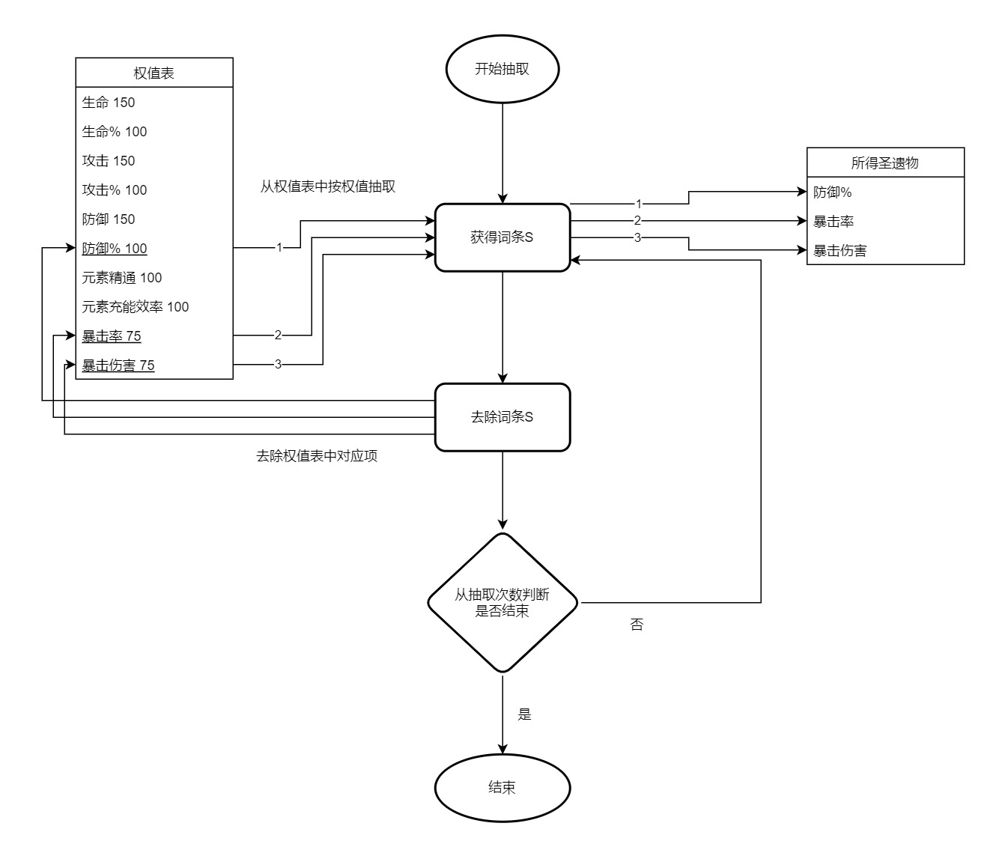
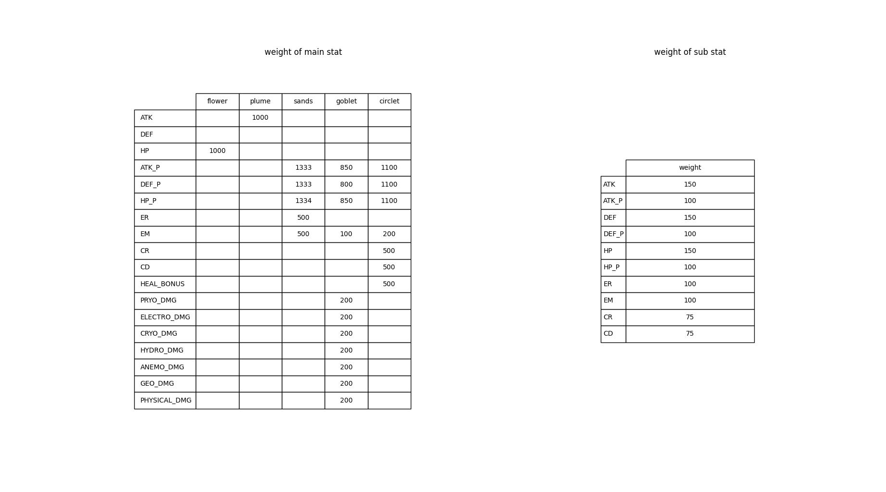
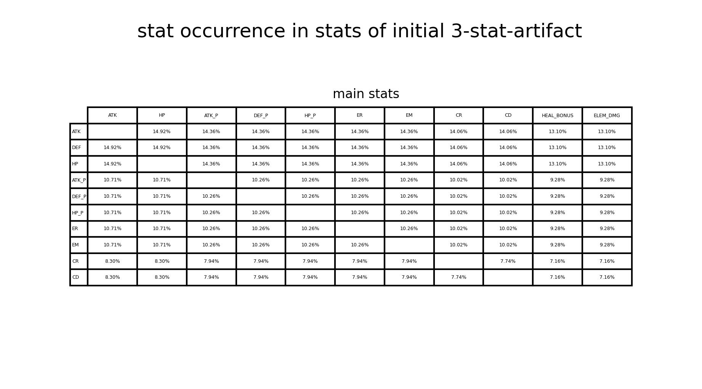
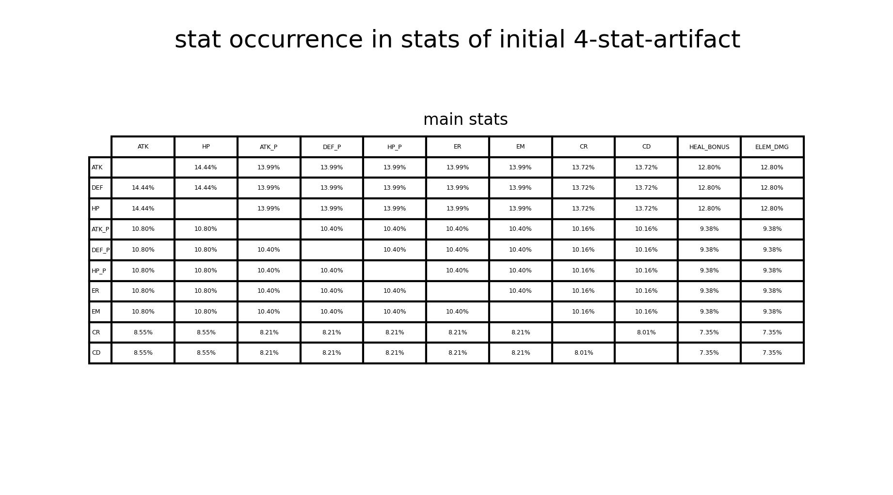
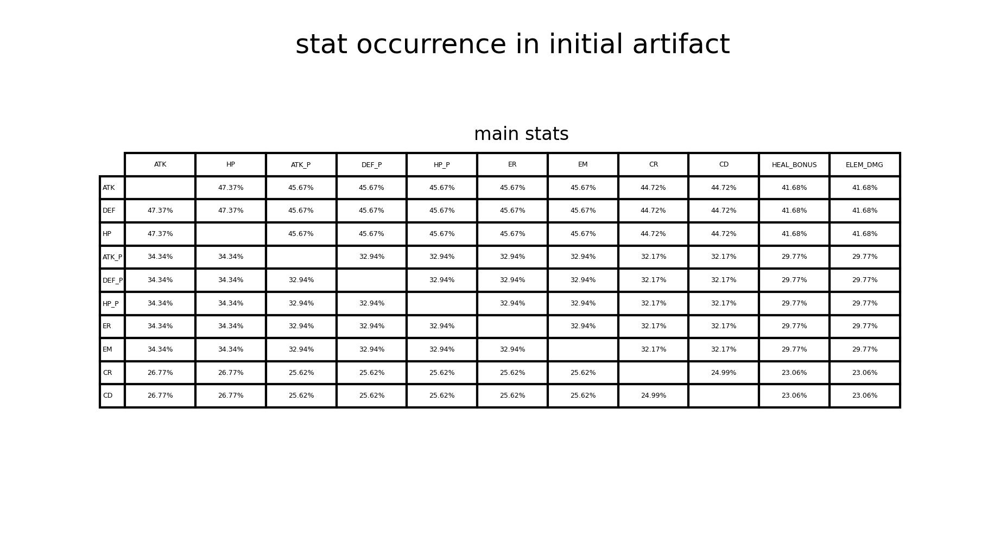
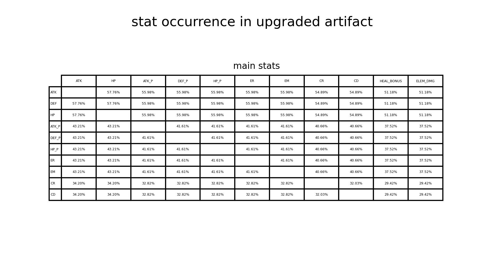
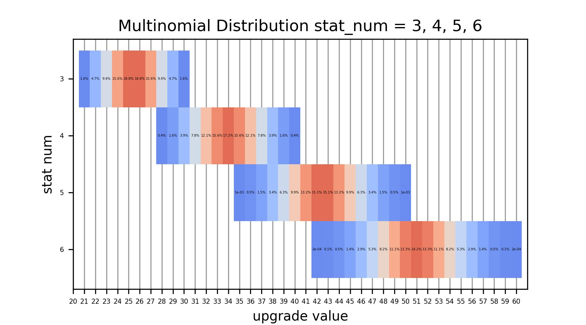
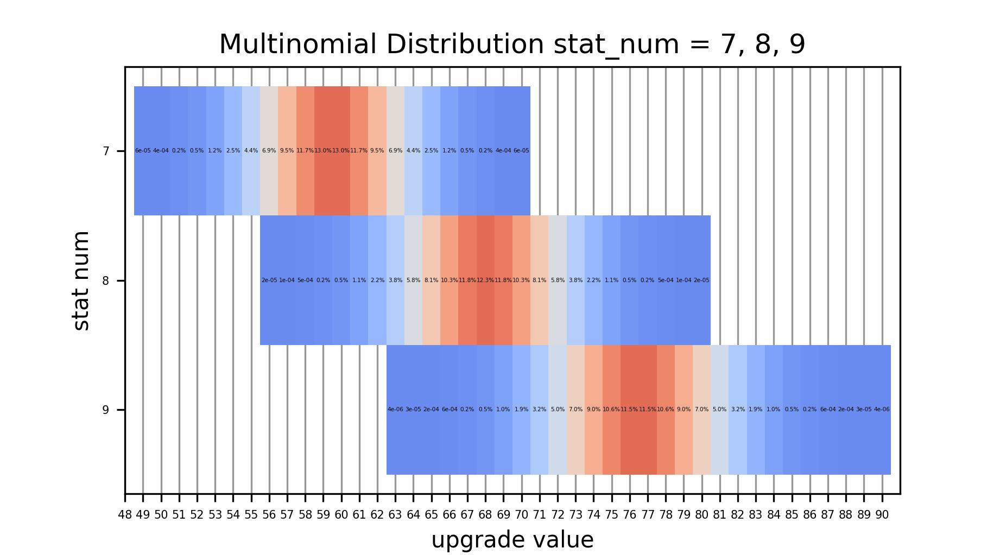
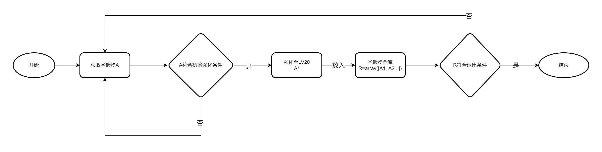
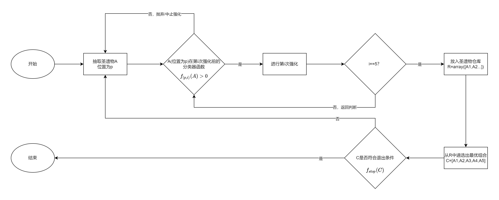

# genshin-artifact-up-model

A well-visualized Genshin Impact artifact upgrade model with classifier (decide whether to upgrade or not)

原神圣遗物强化模型，使用二元分类器决策是否升级，拥有多种可视化方案

## 前言(preface)

### 依赖(Requirements)

```python
numpy
matplotlib
```

### 名词缩写(abbreviation)

```list
    "ATK": "小攻击",
    "ATK_P": "攻击%",
    "DEF": "小防御",
    "DEF_P": "防御%",
    "HP": "小生命",
    "HP_P": "生命%",
    "ER": "元素充能",
    "EM": "元素精通",
    "CR": "暴击率",
    "CD": "暴击伤害",
    "main stat": "主词条",
    "sub stat": "副词条",
    "sets": "套装",
    "flower": "花",
    "plume": "羽",
    "sands": "沙",
    "goblet": "杯",
    "circlet": "冠",
    "HEAL_BONUS": "治疗加成",
    "PRYO_DMG": "火伤",
    "ELECTRO_DMG": "雷伤",
    "CRYO_DMG": "冰伤",
    "HYDRO_DMG": "水伤",
    "ANEMO_DMG": "风伤",
    "GEO_DMG": "岩伤",
    "PHYSICAL_DMG": "物理伤",
    "ELEM_DMG": "元素伤害加成"
```

## 原理

分为数学原理与模型机制来介绍

### 数学原理

#### 加权随机取样(Weighted Random Sampling)

圣遗物词条抽取的过程是加权随机抽样

* 加权随机抽样问题指从n个带权元素集合中按权重抽取m个元素

伪代码实现如下

```pseudo-code
1:for k=1 to m do
2:    pick vi from weight table
      (p_i(k)=w_i/sum(w_j) where j is the element in the weight table)
3:    pop vi from weight table
4: end for
```

具体到原神圣遗物抽取中

```pseudo-code
1:从位置中抽取POS
2:从对应位置POS的主属性中抽取MAIN
3:    获取对应权值表T
4:抽取初始词条N(3 or 4)
5:for k=1 to N do
6:    从权值表T中选择词条S
7:    将权值表T中的S项去除
8:end for
```

例如以下展示一次加权随机取样在圣遗物抽取中的实现

```
1:从位置中抽取到“花”
2:从“花”对应的主属性中抽取到“小生命”
3：抽取到初始4词条
4:when k=1 do
5:    从权值表中抽取
      （比如抽到“暴击率”，权值75，原总权值=1100-150（小生命主词条）=950，对应概率=75/950）
6:    将原来权值表中的“暴击率”一项删去
7:when k=2 do
8:    从权值表中抽取
      （比如抽到“元素精通”，权值100，原总权值=1100-150-75（暴击率的）=875，对应概率=100/875）
9:...
```



> (figure1) Weighted Random Sampling in GI artifact generation

权值表(figure2)我们已经基本知道[1][2]，因此我们可以用计算机模拟这一过程。

算出

1. 在3初始词条圣遗物中，各词条在所有词条中出现的概率(figure3)
2. 在4初始词条圣遗物中，各词条在所有词条中出现的概率(figure4)
3. 在初始圣遗物中，各词条在所有圣遗物中出现的概率(figure5)
4. 在完成升级的圣遗物中，各词条在所有圣遗物中出现的概率(figure6)

值得注意的是(4)中的概率其实就是(2)中概率的4倍，即p4=p2 * 4，从定义上这也是容易理解的；而(3)中概率就是(2)和(1)的乘以对应词条的加权平均，即p3=p1 * 3 * 0.8+p2 * 4 * 0.2

数据验证

结果与[2]中的/Distribution和[3]的结果一致



> (figure2) weight table 权值表



> (figure3) 在3初始词条圣遗物中，各词条在所有词条中出现的概率



> (figure4) 在4初始词条圣遗物中，各词条在所有词条中出现的概率



> (figure5) 在初始圣遗物中，各词条在所有圣遗物中出现的概率



> (figure6) 在完成升级的圣遗物中，各词条在所有圣遗物中出现的概率

参考资料：

[1][github.com/Dimbreath/GenshinData](https://github.com/Dimbreath/GenshinData/blob/master/ExcelBinOutput/ReliquaryMainPropExcelConfigData.json)

[2][Fandom Wiki/Genshin Wiki/Artifacts](https://genshin-impact.fandom.com/wiki/Artifacts/)

[3]小明明明中观察. [【数据讨论】 【提瓦特大学】(附代码)圣遗物副词条与其中的多重概率问题](https://bbs.nga.cn/read.php?tid=26589982) .[OL].2021.5.14

#### 多项分布(Multinomial Distribution)

从强化次数或有效词条到具体数值的过程是多项分布

* 多项分布是二项分布的扩展，其中随机试验的结果不是两种状态，而是K种互斥的离散状态，每种状态出现的概率为pi，p1 + p1 + … + pK = 1，在这个前提下共进行了N次试验，用x1-xK表示每种状态出现次数，x1 + x2 + …+ xK = N，称X=(x1, x2, …, xK)服从多项分布，记作X-PN(N：p1, p2,…,pn)

我们知道圣遗物具体数值分为4个等级，它们之间的比例为7:8:9:10，不妨将强化值设为(7,8,9,10)。圣遗物词条数为3到9，因此词条数为n的圣遗物数值分布在[7n, 10n]

例如：暴击率分布挡位是（2.72, 3.11, 3.50, 3.89）其比例就是7:8:9:10，那么我们把+3.89定义为+10，把+3.50定义为+9，依次类推

由此通过穷举法，算得不同词条数能取得对应值的概率分布

纵轴是有效词条（强化了多少次），横轴是强化出来对应的值（上文例子中的表示），色块上的值是在某有效词条下，强化出对应的值的概率



> (figure7) 词条数=3，4，5，6时的实际值分布



> (figure8) 词条数=7，8，9时的实际值分布

#### 分类器(Classifier)

在一般讨论中，我们常用**线性函数**表示圣遗物的价值，并对超过阈值的圣遗物进行强化

因此在强化中使用**二元分类器**判断是否进行强化是合理且有效的

令分类器为w，圣遗物为a，副词条有10种，添加一个常数项，使其变为11维矢量

$w,a\in R^{11}$

$f(a)=w^Ta$

则强化条件为$f(a)=w^Ta>0$

本模型中使用逻辑回归(Logistic Regression)得到分类器

### 模型机制

#### 简化模型

一般的讨论有些是基于**简化模型**的讨论，该模型有如下特点：

1. 评价标准只适用于初始强化
2. 中途强化过程无评价标准
3. 不对具体位置进行讨论

这将导致以下结果：

1. 强化次数和所得圣遗物数量远大于实际，体现为过快到达退出条件
2. 具体套装和位置不做区分，使退出条件模糊不清



> (figure9) 简化模型

#### 项目模型

项目使用的模型在简化模型的基础上做出如下优化：

1. 对每一级强化，每一个位置，使用不同的分类器进行判断
2. 明确圣遗物仓库中最优组合的定义
3. 使用线性函数规定退出条件



> (figure10) 项目模型

主要存在问题：``

1. 分类器可能会随圣遗物仓库等因素的变化而变化

### 项目实现

#### 表示圣遗物的类-Art

##### 属性

```python
self.'ATK', 'ATK_P', 'DEF', 'DEF_P', 'HP', 'HP_P', 'ER', 'EM', 'CR', 'CD' 
各个副词条的值
self.pos 位置
self.sets 套装
self.main 主词条
```

##### 初始化

```python
def generate(self, main: str, sets: int,  pos: str):
传入位置，套装等信息进行初始化
```

##### 强化

```python
def upgrade(self):
若为3词条，则继续按权值抽取第4个词条
若为4词条，则在已有词条中平权抽取强化词条
```

##### 转换

```python
def __repr__(self) -> str:
转化为字符串

def chinese_output(self) -> str:
转化为中文字符串

def to_list(self) -> List[int]:
转化为列表

def to_array(self) -> np.array:
转化为numpy.array
```

#### 表示强化过程的类-ArtClassifier

##### 属性

```python
self.artifact_finish: Sequence[Tuple[int, Art]] 
完成强化的圣遗物，Tuple[0]为时间

self.artifact_abandon: Sequence[Tuple[int, int, Art]]
未完成强化的圣遗物，Tuple[0]为时间，Tuple[1]为实际强化次数

self.training_data: Mapping[str, Mapping[str, Sequence[Sequence[int]]]]
训练分类器所用数据

self.w: Dict[str, Sequence]
分类器

self.main_stat: Dict[str, str]
主词条，键为位置，值为主词条

self.target_stat: Sequence[str]
所关心的副词条

self.stop_criterion: Callable
退出条件

self.output_mode: bool
输出模式开关
```

##### 初始设定

```python
def set_main_stat(self, main_stat: Mapping[str, str]):
传入主词条字典，设定主词条

def set_target_stat(self, target: Sequence[str]):
传入副词条列表，设定关心的副词条

def set_stop_criterion(self, f: Callable[[Any], bool]):
传入退出条件函数，设定退出条件
输入类型是numpy.array，判断过程为进行矢量内积(或自定义线性函数)，输出一个bool

def set_output(self, flag: bool = True):
设定输出模式，为True会输出模拟的详细过程

def train_data_input(self, path):
传入训练数据

def w_data_input(self, path):
传入w的数据
```

##### 训练与训练输出

```python
def train(self, train_data: Sequence[Sequence[int]]):
使用logistic regression训练分类器

def start_training(self):
training_data设定好后便可以开始训练

def w_data_input(self, path):
将训练好的w输出到json中
```

##### 遴选最优组合

```python
def get_max_combinations(self) -> Dict[str, Any]:

实现逻辑:
分别从仓库中各个位置选出value最大的套装为0的圣遗物和套装为1的圣遗物，若没有则为None
其中value由内置函数evaluate_artifact(Art)->float决定
优先选择套装为0的圣遗物
若选完后总选中件数<5:
    在剩下的位置中选择使value提升最大的套装为1的圣遗物
若选完后总选中件数==5:
    若有使value提升最大的套装为1的圣遗物则选中
```

##### 模拟

```python
def sample_generation(self) -> Art:
随机生成位置，由此按权值抽取主词条
并随机生成一个圣遗物

def start_simulation(self, max_times: int = 1000):
进行好设置之后开始模拟，max_times为单次模拟中抽取次数上限
结果保存在self.artifact_finish，self.artifact_abandon中

def clear_result(self):
清空储存，以便进行下一次模拟
```

#### 可视化

`注意：value由函数evaluate_artifact(Art)->float决定`

##### 对单次模拟的可视化

```python
def view_stack_plot_for_one(sim: ArtClassifier):
传入一次模拟的结果
输出堆栈图(figure11)
其中y值表示对应词条的数量

def view_step_plot_for_one(sim: ArtClassifier):
传入一次模拟的结果
输出台阶图(figure12)
其中台阶线表示过程中value的增长情况，
散点表示仓库中新加入的圣遗物，
散点大小表示这个圣遗物的有效词条，
红色表示次数没有形成4件套，绿色表示此时形成了4件套
```

##### 对多次模拟的可视化

```python
#定义
recorder: List[Tuple[List, List]]
包含一串(artifact_finish, artifact_abandon)的列表
使用:
recorder = []
recorder.append((sim.artifact_finish.copy(), sim.artifact_abandon.copy()))
生成

def view_value_growth(recorder, length: int):
传入多次模拟结果
输出value的成长曲线(figure13)
length不应大于模拟中的max_times

def view_stack_plot(recorder, length: int, target_stat: List[str]):
传入多次模拟结果
输出经平均后的堆栈图(figure14)
length不应大于模拟中的max_times
target_stat可以使用sim.target_stat直接传入

def view_scatter_plot(recorder, x: str = 'finish', y: str = 'abandon'):
传入多次模拟结果
输出关于x-y的散点图(figure15)
x,y的可选值:
['finish'|'half'|'init'|'abandon'|'value'|'complete'|'last']
散点大小由最优组合的value确定

def view_hist_plot(recorder, x: str = 'value'):
传入多次模拟结果
输出关于x的直方分布图(figure16)
x的可选值:
['finish'|'half'|'init'|'abandon'|'value'|'complete'|'last']

def view_box_plot(recorder):
传入多次模拟结果
输出箱型图图(figure17)
```
