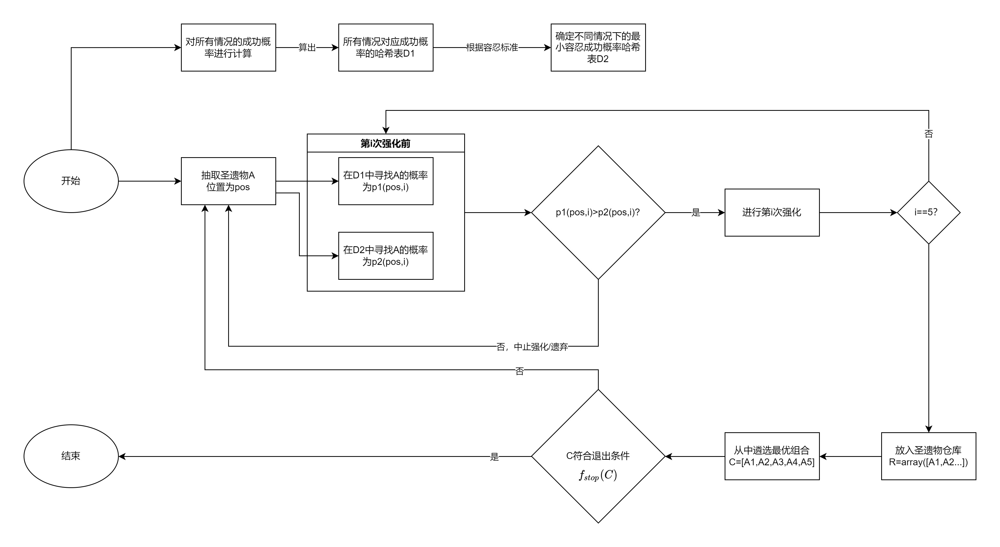
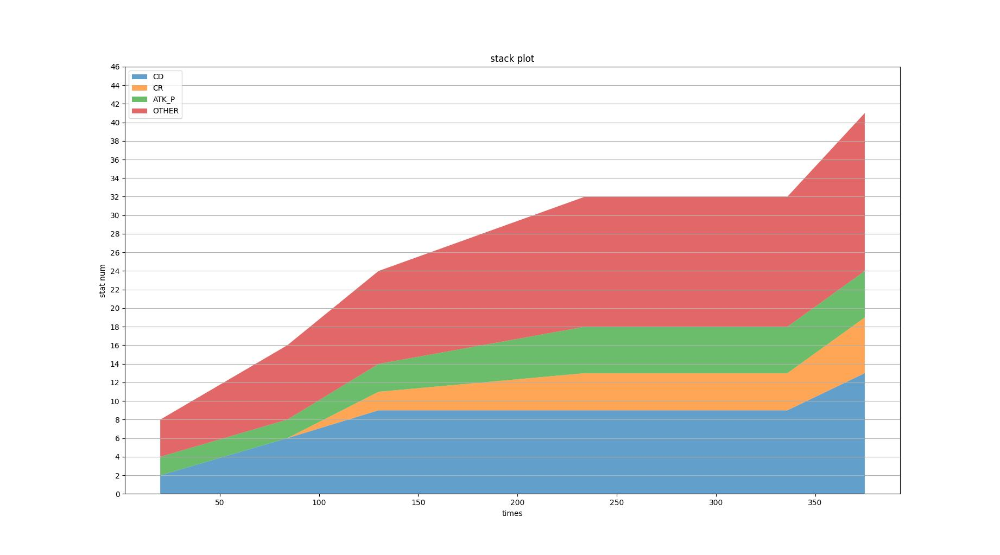
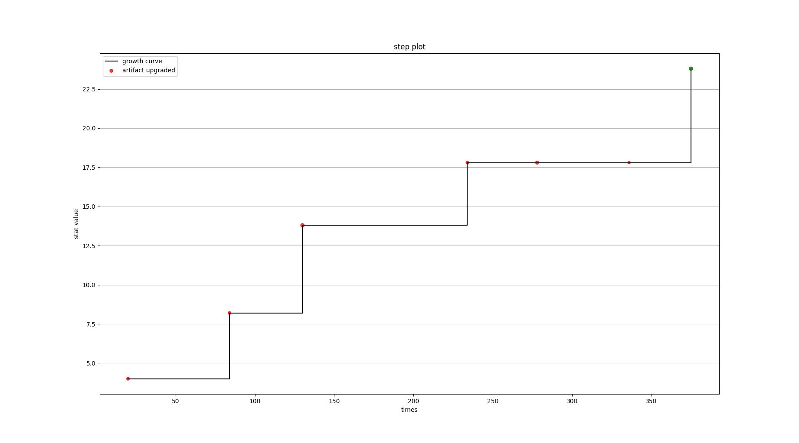
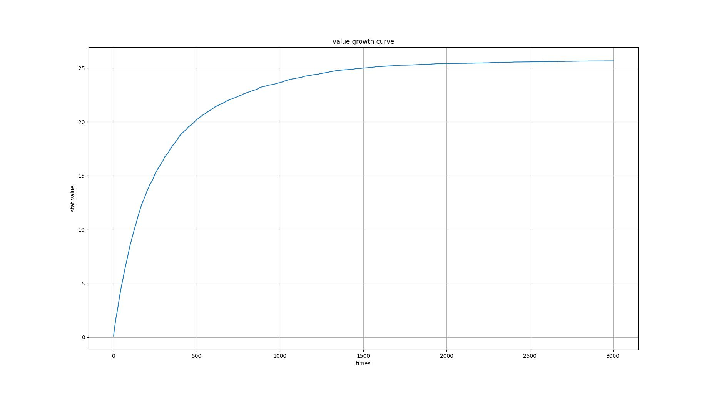
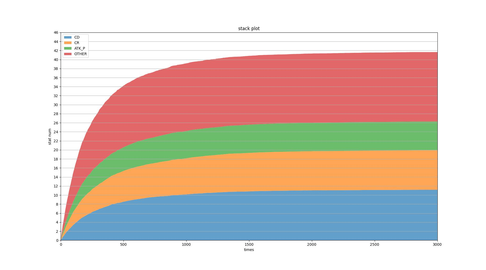
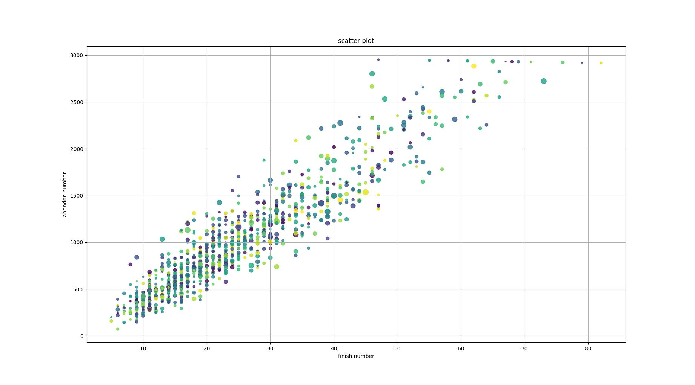
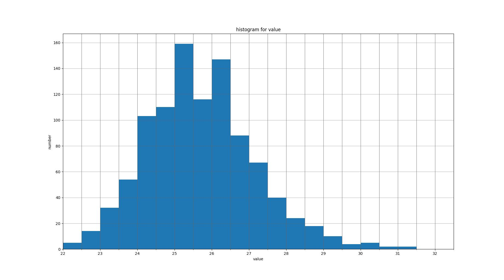

# genshin-artifact-up-model

A rational and well-visualized Genshin Impact artifact upgrade model

原神圣遗物强化模型，对每次强化计算达阈值概率以决策是否升级，拥有多种可视化方案

## 前言(preface)

### 依赖(Requirements)

```python
numpy
matplotlib
```

### 名词缩写(abbreviation)

```list
    "ATK": "小攻击",
    "ATK_P": "攻击%",
    "DEF": "小防御",
    "DEF_P": "防御%",
    "HP": "小生命",
    "HP_P": "生命%",
    "ER": "元素充能",
    "EM": "元素精通",
    "CR": "暴击率",
    "CD": "暴击伤害",
    "main stat": "主词条",
    "sub stat": "副词条",
    "sets": "套装",
    "flower": "花",
    "plume": "羽",
    "sands": "沙",
    "goblet": "杯",
    "circlet": "冠",
    "HEAL_BONUS": "治疗加成",
    "PRYO_DMG": "火伤",
    "ELECTRO_DMG": "雷伤",
    "CRYO_DMG": "冰伤",
    "HYDRO_DMG": "水伤",
    "ANEMO_DMG": "风伤",
    "GEO_DMG": "岩伤",
    "PHYSICAL_DMG": "物理伤",
    "ELEM_DMG": "元素伤害加成"
```

## 原理

分为数学原理与模型机制来介绍

### 数学原理

#### 加权随机取样(Weighted Random Sampling)

圣遗物词条抽取的过程是加权随机抽样

* 加权随机抽样问题指从n个带权元素集合中按权重抽取m个元素

伪代码实现如下

```pseudo-code
1:for k=1 to m do
2:    pick vi from weight table
      (p_i(k)=w_i/sum(w_j) where j is the element in the weight table)
3:    pop vi from weight table
4: end for
```

具体到原神圣遗物抽取中

```pseudo-code
1:从位置中抽取POS
2:从对应位置POS的主属性中抽取MAIN
3:    获取对应权值表T
4:抽取初始词条N(3 or 4)
5:for k=1 to N do
6:    从权值表T中选择词条S
7:    将权值表T中的S项去除
8:end for
```

例如以下展示一次加权随机取样在圣遗物抽取中的实现

```
1:从位置中抽取到“花”
2:从“花”对应的主属性中抽取到“小生命”
3：抽取到初始4词条
4:when k=1 do
5:    从权值表中抽取
      （比如抽到“暴击率”，权值75，原总权值=1100-150（小生命主词条）=950，对应概率=75/950）
6:    将原来权值表中的“暴击率”一项删去
7:when k=2 do
8:    从权值表中抽取
      （比如抽到“元素精通”，权值100，原总权值=1100-150-75（暴击率的）=875，对应概率=100/875）
9:...
```


> (figure1) Weighted Random Sampling in GI artifact generation

权值表(figure2)我们已经基本知道[1][2]，因此我们可以用计算机模拟这一过程。

算出

1. 在3初始词条圣遗物中，各词条在所有词条中出现的概率(figure3)
2. 在4初始词条圣遗物中，各词条在所有词条中出现的概率(figure4)
3. 在初始圣遗物中，各词条在所有圣遗物中出现的概率(figure5)
4. 在完成升级的圣遗物中，各词条在所有圣遗物中出现的概率(figure6)

值得注意的是(4)中的概率其实就是(2)中概率的4倍，即p4=p2 * 4，从定义上这也是容易理解的；而(3)中概率就是(2)和(1)的乘以对应词条的加权平均，即p3=p1 * 3 * 0.8+p2 * 4 * 0.2

数据验证

结果与[2]中的/Distribution和[3]的结果一致


> (figure2) weight table 权值表


> (figure3) 在3初始词条圣遗物中，各词条在所有词条中出现的概率


> (figure4) 在4初始词条圣遗物中，各词条在所有词条中出现的概率


> (figure5) 在初始圣遗物中，各词条在所有圣遗物中出现的概率


> (figure6) 在完成升级的圣遗物中，各词条在所有圣遗物中出现的概率

参考资料：

[1][github.com/Dimbreath/GenshinData](https://github.com/Dimbreath/GenshinData/blob/master/ExcelBinOutput/ReliquaryMainPropExcelConfigData.json)

[2][Fandom Wiki/Genshin Wiki/Artifacts](https://genshin-impact.fandom.com/wiki/Artifacts/)

[3]小明明明中观察. [【数据讨论】 【提瓦特大学】(附代码)圣遗物副词条与其中的多重概率问题](https://bbs.nga.cn/read.php?tid=26589982) .[OL].2021.5.14

#### 多项分布(Multinomial Distribution)

从强化次数或有效词条到具体数值的过程是多项分布

* 多项分布是二项分布的扩展，其中随机试验的结果不是两种状态，而是K种互斥的离散状态，每种状态出现的概率为pi，p1 + p1 + … + pK = 1，在这个前提下共进行了N次试验，用x1-xK表示每种状态出现次数，x1 + x2 + …+ xK = N，称X=(x1, x2, …, xK)服从多项分布，记作X-PN(N：p1, p2,…,pn)

我们知道圣遗物具体数值分为4个等级，它们之间的比例为7:8:9:10，不妨将强化值设为(7,8,9,10)。圣遗物词条数为3到9，因此词条数为n的圣遗物数值分布在[7n, 10n]

例如：暴击率分布挡位是（2.72, 3.11, 3.50, 3.89）其比例就是7:8:9:10，那么我们把+3.89定义为+10，把+3.50定义为+9，依次类推

由此通过穷举法，算得不同词条数能取得对应值的概率分布

纵轴是有效词条（强化了多少次），横轴是强化出来对应的值（上文例子中的表示），色块上的值是在某有效词条下，强化出对应的值的概率


> (figure7) 词条数=3，4，5，6时的实际值分布


> (figure8) 词条数=7，8，9时的实际值分布

#### 分类器(Classifier)

在一般讨论中，我们常用**线性函数**表示圣遗物的价值，并对超过阈值的圣遗物进行强化

因此在强化中使用**二元分类器**判断是否进行强化是有效的

令分类器为w，圣遗物为a，副词条有10种，添加一个常数项，使其变为11维矢量

$w,a\in R^{11}$

$f(a)=w^Ta$

则强化条件为$f(a)=w^Ta>0$

本模型中使用逻辑回归(Logistic Regression)得到分类器

### 模型机制

#### 简化模型

一般的讨论有些是基于**简化模型**的讨论，该模型有如下特点：

1. 评价标准只适用于初始强化
2. 中途强化过程无评价标准
3. 不对具体位置进行讨论

这将导致以下结果：

1. 强化次数和所得圣遗物数量远大于实际，体现为过快到达退出条件
2. 具体套装和位置不做区分，使退出条件模糊不清


> (figure9) 简化模型

#### 分类器模型

分类器模型在简化模型的基础上做出如下优化：

1. 对每一级强化，每一个位置，使用不同的分类器进行判断
2. 明确圣遗物仓库中最优组合的定义
3. 使用线性函数规定退出条件


> (figure10) 分类器模型

主要存在问题：

1. 分类器可能会随圣遗物仓库等因素的变化而变化
2. 分类器训练需要海量数据，难以人力实现

#### 成功概率模型

一种更加理性的决策是计算圣遗物达到预期的概率后再决定是否强化

（直觉上这比单单使用分类器更加理性，因为分类器很容易漏选或多选。这一猜想未经证明）

模型过程：

1. 对每种情况都计算达阈值的概率（成功概率）
2. 对不同位置，在计算成功概率后，对某种条件下的所有情况，对其进行排序，计算累积概率函数
3. 设定容忍度等级，通过容忍度等级确定某种累积概率函数的分位数
4. 确定成功概率和容忍度的对应分位数后，对每次强化，查找成功概率和分位数，当成功概率大于分位数时进行强化

缺点：

1. 容忍度等级会随圣遗物仓库等因素的变化而变化（实现上可行，但囿于python性能限制，实现后会拖慢模拟速度）



> (figure11) 成功概率模型

## 项目实现

### 表示圣遗物的类-Art

#### 属性

```python
self.'ATK', 'ATK_P', 'DEF', 'DEF_P', 'HP', 'HP_P', 'ER', 'EM', 'CR', 'CD' 
各个副词条的词条数
self.pos 位置
self.sets 套装
self.main 主词条
self.upgrade_time 强化次数
```

#### 初始化

```python
def generate(self, main: str, sets: int,  pos: str):
传入位置，套装等信息进行初始化
```

#### 强化

```python
def upgrade(self):
若为3词条，则继续按权值抽取第4个词条
若为4词条，则在已有词条中平权抽取强化词条
```

#### 转换

```python
def __repr__(self) -> str:
转化为字符串

@property
def chinese(self) -> str:
转化为中文字符串

@property
def list(self) -> List[int]:
转化为列表

@property
def array(self) -> np.array:
转化为numpy.array
```

### 表示强化过程的类-ArtSimulation

#### 属性

```python
self.artifact_finish: Sequence[Tuple[int, Art]] 
完成强化的圣遗物，Tuple[0]为时间

self.artifact_abandon: Sequence[Tuple[int, int, Art]]
未完成强化的圣遗物，Tuple[0]为时间，Tuple[1]为实际强化次数

self.p: ArtPossibility
鉴定概率是否达到阈值

self.main_stat: Dict[str, str]
主词条，键为位置，值为主词条

self.target_stat: Sequence[str]
所关心的副词条

self.stop_criterion: Callable
退出条件

self.output_mode: bool
输出模式开关
```

#### 初始设定

```python
main_stat: Mapping[str, str]
传入主词条字典，设定主词条

target_stat: Sequence[str]
传入副词条列表，设定关心的副词条

stop_criterion: Callable[[Any], bool]
传入退出条件函数，设定退出条件
输入类型是numpy.array，判断过程为进行矢量内积(或自定义线性函数)，输出一个bool

output_mode: bool
设定输出模式，为True会输出模拟的详细过程

threshold: Mapping[str, float]
各个位置value的阈值

上述属性设定好后，使用
def initialize():
进行self.p的初始化和其他初始化
```

#### 遴选最优组合

```python
@staticmethod
def evaluate_artifact(a: Art, value_vector: Sequence[float]) -> float:
静态函数用于计算圣遗物的value

def get_max_combinations(self) -> Dict[str, Any]:

实现逻辑:
分别从仓库中各个位置选出value最大的套装为0的圣遗物和套装为1的圣遗物，若没有则为None
其中value由内置函数evaluate_artifact(Art)->float决定
优先选择套装为0的圣遗物
若选完后总选中件数<5:
    在剩下的位置中选择使value提升最大的套装为1的圣遗物
若选完后总选中件数==5:
    若有使value提升最大的套装为1的圣遗物则选中
```

#### 模拟

```python
def sample_generation(self) -> Art:
随机生成位置，由此按权值抽取主词条
并随机生成一个圣遗物
使用算法：Algorithm A With a Reservoir(A-Res)
(比直接choice稍有优化，因为n不大所以速度优势不能体现)

def start_simulation(self, max_times: int = 1000):
进行好设置之后开始模拟，max_times为单次模拟中抽取次数上限
中途会在某位置有对应圣遗物后上调对应容忍等级
结果保存在self.artifact_finish，self.artifact_abandon中

def clear_result(self):
清空储存，以便进行下一次模拟
重置self.p.tolerance
```

### 计算成功概率的类-ArtPossibility

#### 属性

```python
self.main_stat: Dict[str, str]
主词条

self.evaluate: Callable[[Any], float]
用于确定圣遗物value的函数

self.threshold: Dict[str, float]
不同位置的value的阈值

self.tolerance: Dict[str, int]
容忍度等级，分为0，1，2，3级

self.tolerance_p: Dict[str, Dict[str, Dict[str, Dict[int, float]]]]
# tolerance_p[pos][len][up][tolerance_lv] = p
不同容忍等级下圣遗物应具有的最小成功概率

self.possibilities: Dict[str, Dict[str, Dict[str, Dict[tuple, float]]]]
# possibilities[pos][len][up][tuple] = p
不同圣遗物成功达到阈值的概率
```

#### 访问

```python
def get_p(self, art: Art):
# 通过圣遗物实例访问成功概率
    return self.possibilities[art.pos][len(art)][art.upgrade_time].get(tuple(art.list))

def get_t(self, art: Art):
# 通过圣遗物实例访问对应容忍度下的最小成功概率
    return self.tolerance_p[art.pos][len(art)][art.upgrade_time].get(self.tolerance[art.pos])
```

#### 数据生成

```python
def recursive_possibilities(self, art: Art) -> float:
递归地对有4词条以上的圣遗物计算达到阈值的成功概率

def generate_possibilities(self, position: str):
计算某部位所有圣遗物组合的成功概率
使用算法：枚举
注意：引入强化次数，4词条0强化与4词条1强化不同
注意：3词条圣遗物要按权值抽取词条后再递归计算

def generate_tolerance(self, position):
计算不同容忍度下的最小成功概率
使用算法：排序
对某位置，某总词条数，某强化次数，某容忍等级
计算概率函数(累计概率的函数)
找到0.5分位数，0.6分位数，0.7分位数和0.8分位数，分别赋予0，1，2，3级
```

#### 初始化及使用

```python
def initialize(self)：
需要输入self.threshold，self.main_stat，self.evaluate
后进行初始化

def judge(self, art: Art) -> bool:
输入圣遗物实例
输出对其是否到达容忍的成功概率的判断结果
```

### 可视化-data_view

`注意：value由函数evaluate_artifact(Art)->float决定`

#### 对单次模拟的可视化

```python
def view_stack_plot_for_one(sim: ArtSimulation):
传入一次模拟的结果
输出堆栈图#(figure2.1)
其中y值表示对应词条的数量

def view_step_plot_for_one(sim: ArtSimulation):
传入一次模拟的结果
输出台阶图#(figure2.2)
其中台阶线表示过程中value的增长情况，
散点表示仓库中新加入的圣遗物，
散点大小表示这个圣遗物的有效词条，
红色表示次数没有形成4件套，绿色表示此时形成了4件套
```



> figure2.1



> figure2.2

#### 对多次模拟的可视化

```python
#定义
recorder: List[Tuple[List, List]]
包含一串(artifact_finish, artifact_abandon)的列表
使用:
recorder = []
recorder.append((sim.artifact_finish.copy(), sim.artifact_abandon.copy()))
生成

def view_value_growth(recorder, length: int):
传入多次模拟结果
输出value的成长曲线#(figure2.3)
length不应大于模拟中的max_times

def view_stack_plot(recorder, length: int, target_stat: List[str]):
传入多次模拟结果
输出经平均后的堆栈图#(figure2.4)
length不应大于模拟中的max_times
target_stat可以使用sim.target_stat直接传入

def view_scatter_plot(recorder, x: str = 'finish', y: str = 'abandon'):
传入多次模拟结果
输出关于x-y的散点图#(figure2.5)
x,y的可选值:
['finish'|'half'|'init'|'abandon'|'value'|'complete'|'last']
散点大小由最优组合的value确定

def view_hist_plot(recorder, x: str = 'value'):
传入多次模拟结果
输出关于x的直方分布图#(figure2.6)
x的可选值:
['finish'|'half'|'init'|'abandon'|'value'|'complete'|'last']

def view_box_plot(recorder):
传入多次模拟结果
输出箱型图图#(figure2.7)
```



> figure2.3



> figure2.4



> figure2.5



> figure2.6


> figure2.7

## 应用实例

实例：以雷神为例，设置如下

```
主词条（main_stat）
沙：充能
杯：雷伤
冠：暴击率

副词条（target_stat）
攻击，暴击率，暴击伤害

评价标准（evaluate_artifact）
value=小攻击*0.2+攻击*0.6+充能*0.4+暴击率*1+暴击伤害*1

阈值（threshold）
花羽：4
沙杯：3
冠：2

退出条件（stop_criterion）
双爆>=18 and 攻双爆>=24
```

导出结果在./doc/samplegraph下

同时，见文章

[](https://)
